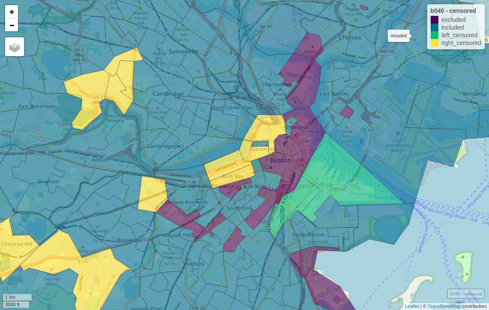
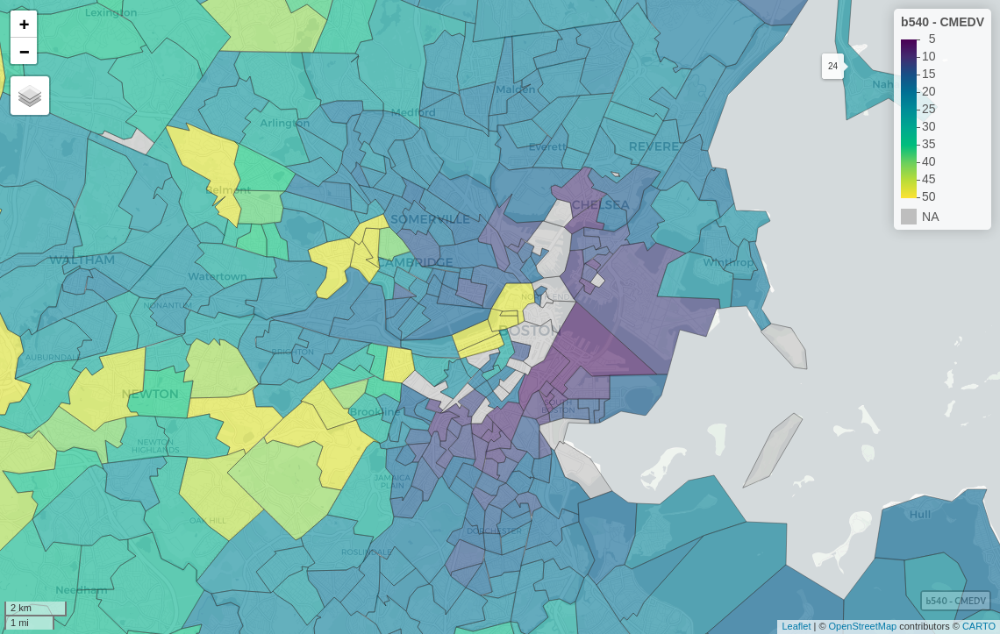
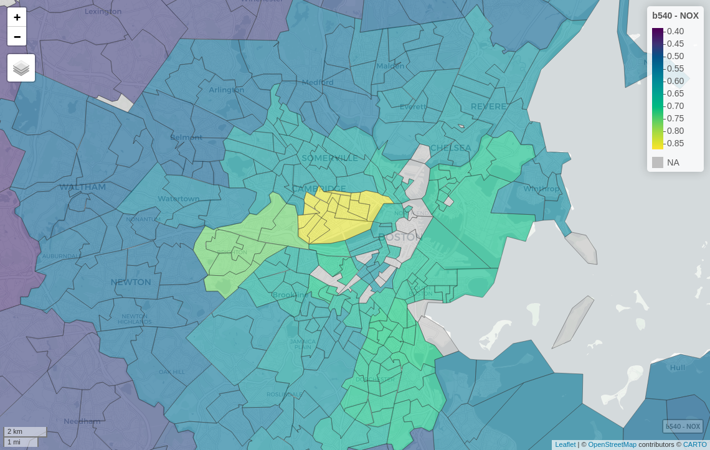

```{r setup, include=FALSE}
knitr::opts_chunk$set(echo = TRUE, paged.print=FALSE)
.libPaths(c(.libPaths()[1], paste(.libPaths()[1], "_retiring", sep="")))
```


## Webinar aims

- To provide participants with an overview of one of the three kinds of modelling with spatial data, namely areal or lattice data modelling

- It will become clear that these kinds of data may be characterised by spatial autocorrelation

- On the one hand, information leaking between neighbouring spatial entities needs to be taken into account

- On the other, we will see that looking carefully at spatial entities, and understanding that such spillovers can occur, may lead us to clearer analysis


## Webinar learning outcomes

- Being able to place spatial econometrics in a broader context of modelling with spatial data

- Knowing the most common models proposed by spatial econometrics

- Knowing which R packages provide these models

- Understanding the concepts of support, spatial autocorrelation, and how they may interact when modelling with spatial data


## Webinar contents

- What is spatial econometrics? How does it relate to econometrics and to other fields modelling with spatial data?

- Which estimation methods are used in spatial econometrics, which are specific to spatial econometrics, and which shared with proximate fields?

- How are spatial (and spatio-temporal) data represented in R packages, and which packages provide implementations of relevant estimation methods?

- Boston housing value data set: case of trying to study a problem when the support of the data probably does not match the problem

# Spatial econometrics

## Spatial econometrics

- @anselin:10 indicates clearly and repeatedly [@anselin:88] that we should acknowledge *Spatial Econometrics* by @paelinck+klaassen:79 of the Netherlands Economic Institute as our starting point (see also @hordijk:74 and @hordijk+paelinck:76)

- In a short commentary, @paelinck:13 recalls his conviction, expressed in 1967, that "early econometric exercises $\ldots$ relating only variables possessing the same regional index $\ldots$ were inadequate to represent the correct spatial workings of the economy, which would then be reflected in the policy outcomes."

- Central government expenditure in region $i$ could spill over into income and consumption in other regions, through labour market and interregional trade channels

## Statistical maps

- Two statisticians, @moran48 and @geary:54, had proposed measures that began to address the need to infer from maps

- Geary's measure was followed up by @duncanetal61 in *Statistical geography: Problems in analyzing areal data*, where they point to issues raised by the modifiable nature of spatial units used for collecting and analysing information (modifiable areal unit problem, MAUP)

- "Sooner or later in a study of areal variation the investigator runs up against the fact that areal units situated close to each other are more likely to be similar in their characteristics than are areal units which are some distance apart $\ldots$ " (pp. 128--9)

- and heterogeneity --- for example upper level units "breaking up" the smooth surface of lower level units


## Spatial autocorrelation

- @cliff+ord:69 generalised the way in which neighbours could be defined as a spatial weights matrix  (see [Ch. 14](https://r-spatial.org/book/14-Areal.html)), and in *Spatial Autocorrelation* [@cliff+ord:73] set out the framework for global measures of spatial autocorrelation

- @ord:10 reflects on their legacy, expressing doubt that the serious points raised by @granger:69 (and noted by @ripley:88) had been addressed adequately

- Another early summary (@hepple:74) shows how much had already been grasped, including the impact of spatial autocorrelation on multivariate analysis 

- Finally, @10.2307/143141 proposed a "first law" of geography, immediately criticised by @10.2307/143140 for over-reaching (see [Ch. 15](https://r-spatial.org/book/15-Measures.html#measures-and-process-mis-specification))

## Spatial autocorrelation in regression residuals

- Using the tools created to examine spatial autocorrelation, it became possible to extend to regression residuals

- @CliffOrd:72 provided an extension of Moran's $I$ to regression residuals, followed by @hordijk:74

- It was long felt that the omission of special (spatial) treatment for models using spatial data invalidated inferences made

- In a careful study, @smith+lee12 show that inferences are not affected only when covariates are not spatially autocorrelated

## Spatial econometrics or spatially structured random effects?

- From the mid 1970's, two traditions developed, one handling the effects of spatial autocorrelation in modelling in ways analogous to time series, the other adding spatially structured random effects to models

- The latter was proposed by @besag:74, and has been widely adopted in spatial epidemiology (disease mapping) and spatial ecology, as an effective way of including the unobserved spatial process

- Both @besag:74 and @cliff+ord:73 reach back to @whittle:54, but the subsequent developments of conditional autoregression models (CAR, spatially structured random effects) and simultaneous (joint) autoregression models (SAR, spatial econometrics), have diverged. Ord takes this up in his discussion of @besag:74, page 229 (see also [Ch. 16](https://r-spatial.org/book/16-SpatialRegression.html#markov-random-field-and-multilevel-models))

## Models, models, models

We can represent a simple modelling situation in the following way:
\[
\mathbf{data} = \mathbf{smooth} + \mathbf{rough}
\]
where the $\mathbf{rough}$ are taken to have no remaining patterning
information. If, on the other hand, useful information remains in the
$\mathbf{rough}$, for example with discernible spatial patterning,
we can try to retrieve it:
\[
\mathbf{data} = \mathbf{smooth} + \mathbf{spatial\ smooth} + \mathbf{rough}
\]
This is useful both for predictions from $\mathbf{smooth} +
\mathbf{spatial\ smooth}$, and possibly less biassed inference from the
$\mathbf{smooth}$.


## Spatial smooth: spatially structured random effects

- The spatially structured random effects literature is very rich, and now expresses the $\mathbf{spatial\ smooth}$ in the context of linear mixed models (LMM)

- This can be extended to generalised linear mixed models (GLMM) and to multi-level models

- The spatial structuring is typically described as by a Markov Random Field (MRF) term added to the model, either with a parametric or intrinsic  conditional autoregressive form; the MRF is expressed through a graph of 0/1 neighbours

- The output includes an estimate of the random effect for each observation --- which may be mapped, and an expression of the distribution around those estimates

## Spatial smooth: spatial lag model

In spatial econometrics, the $\mathbf{spatial\ smooth}$ term is not as simple. 

The spatial lag model (SLM, a.k.a SAR) is the most frequently encountered specification in 
spatial econometrics:

\begin{displaymath}
{\mathbf y} = \rholag {\mathbf W}{\mathbf y} + {\mathbf X}\beta + \varepsilon,
\end{displaymath}
\noindent
where ${\mathbf y}$ is an $(N \times 1)$ vector of observations on
a dependent variable taken  at each of $N$ locations, ${\mathbf W}$ is 
a fixed $(N \times N)$ spatial weights matrix, ${\mathbf X}$
is an $(N \times k)$ matrix of exogenous variables, $\beta$
is an $(k \times 1)$ vector of parameters, $\varepsilon$
is an $(N \times 1)$ vector of independent and identically distributed 
disturbances and $\rholag$ is a scalar spatial lag parameter.

The $\mathbf{spatial\ smooth}$ term is $\rholag {\mathbf W}{\mathbf y}$.

## Spatial smooth: spatial Durbin model

In the spatial Durbin model (SDM), the spatially lagged exogenous variables 
are added to the model; spatial Durbin models are reviewed by @mur+angulo:06:

\begin{displaymath}
{\mathbf y} = \rholag {\mathbf W}{\mathbf y} + {\mathbf X}\beta + 
{\mathbf W}{\mathbf X}\gamma + \varepsilon,
\end{displaymath}
\noindent
where $\gamma$ is an $((k-1) \times 1)$ vector of parameters
where ${\mathbf W}$ is row-standardised (all rows sum to unity), and a $(k \times 1)$ vector otherwise. 

The $\mathbf{spatial\ smooth}$ term is $\rholag {\mathbf W}{\mathbf y} + {\mathbf W}{\mathbf X}\gamma$.

## How to interpret regression coefficients

@lesage+pace:09 show that these models share a complicated data generation process: 

\begin{displaymath}
{\mathbf y} = ({\mathbf I} - \rholag {\mathbf W})^{-1}({\mathbf X}\beta + {\mathbf W}{\mathbf X}\gamma) + \varepsilon.
\end{displaymath}

in which $\rholag$ and $\beta$ (and possibly $\gamma$) interact. These measures of the effects of each included covariate need to be estimated in addition to fitting the model

## Spatial smooth: spatial error model

The spatial error model (SEM) may be written as @ord:75 or @hepple:76:

\begin{displaymath}
{\mathbf y} = {\mathbf X}\beta + {\mathbf u},
\qquad {\mathbf u} = \rhoerr {\mathbf W} {\mathbf u} + \varepsilon,
\end{displaymath}

and ${\mathbf u}$ is a spatially autocorrelated
disturbance vector with constant variance $\sigma^2$ and covariance terms specified:

\begin{displaymath}
{\mathbf u} \sim N(0, \sigma^2 ({\mathbf I} - \rhoerr {\mathbf W})^{-1}
({\mathbf I} - \rhoerr {\mathbf W}^\top)^{-1})
\end{displaymath}

## What to do about time?

Spatio-temporal models in the spatially structured random effects branch are just (G)LMM with a added temporal random effect. Non-separability between time and space remains a problem, but a lot can be achieved, see @blangiardo2015spatial and @gomez2020bayesian

In the spatial econometrics branch, @ISI:000184416700002 presents the extension of panel econometrics to spatial panel data (see also @Elhorst2014). In extending to time panels, a range of combined models has also come into being, a general nested model (GNM) nesting all the others, a model without spatially lagged covariates (SARAR). If neither the residuals nor the response are modelled with spatial processes, spatially lagged covariates may be added to a linear model, as a spatially lagged X model (SLX) [@lesage:14; @halleck-vega+elhorst:15]. We can write the GNM as (here a cross-sectional model for simplicity):

\begin{displaymath}
{\mathbf y} = \rho_{\mathrm{Lag}} {\mathbf W}{\mathbf y} + {\mathbf X}\beta + {\mathbf W}{\mathbf X}\gamma + {\mathbf u},
\qquad {\mathbf u} = \rho_{\mathrm{Err}} {\mathbf W} {\mathbf u} + \varepsilon.
\end{displaymath}

## Which branch?

- The literature covering both the development and especially the use of spatially structured random effects (SSRE) is vast, and they have few problems with limited dependent variables

- The literature on the specification and development of spatial econometrics models (including spatial panel models) is large, but usage is limited, not least because of the need to choose between model specifications; only this branch may open for instrumenting endogenous covariates

- Both use the same specifications defining neighbours of observations, but spatial econometrics models most often use row standardised spatial weights, and SSRE most often use binary spatial weights (and require symmetric weights in a single graph)

# Estimation methods for spatial econometrics

## Estimation methods for spatial econometrics

- The estimation methods first introduced by @ord:75 and @hepple:76 used maximum likelihood (ML); this was followed up by @anselin:88

- Bayesian methods are reviewed by @lesage+pace:09

- Generalised method of moments (GMM) methods are reviewed by @KelejianPiras:2017, based on earlier work by [@kelejian+prucha:98; @kelejian+prucha:98]

- Other methods like the @CONLEY19991 approach are clearly spatial econometrics, but are not often discussed in the same way (no spatial weights matrices are used)

- Please see @math9111276 and @bivand+piras:15 for summaries of ML and GMM approaches; the former also covers spatial panel models

## Maximum likelihood

The log-likelihood function for the spatial lag model is:

\begin{eqnarray*}
\ell(\beta, \rholag, \sigma^2) = - \frac{N}{2} \ln 2 \pi - 
\frac{N}{2} \ln \sigma^2 + \ln |{\mathbf I} - \rholag {\mathbf W}| \\
- \frac{1}{2 \sigma^2} \big[(({\mathbf I} - \rholag {\mathbf W}){\mathbf y} 
- {\mathbf X}\beta)^\top(({\mathbf I} - \rholag {\mathbf W}){\mathbf y} 
- {\mathbf X}\beta)\big]
\end{eqnarray*}
\noindent
and by extension the same framework is used for SDM when $[{\mathbf X} ({\mathbf W}{\mathbf X})]$ are grouped together. The sum-of-squared errors (SSE) term in the square brackets is found using auxiliary regressions ${\mathbf e} = {\mathbf y}-({\mathbf X}^\top{\mathbf X}){\mathbf X}{\mathbf y}$ and ${\mathbf u} = {\mathbf W}{\mathbf y}-({\mathbf X}^\top{\mathbf X}){\mathbf X}{\mathbf W}{\mathbf y}$, 
and $SSE = {\mathbf e}^\top{\mathbf e} - 2 \rholag {\mathbf u}^\top{\mathbf e} + \rholag^2 {\mathbf u}^\top{\mathbf u}$. 
The cross-products of ${\mathbf u}$ and ${\mathbf e}$ can conveniently be calculated before line search (univariate non-linear optimisation) begins.


## Log determinant

The first published versions of the eigenvalue method for
finding the log determinant @ord:75 is:

\begin{displaymath}
\ln(|{\mathbf I} - \rho {\mathbf W}|) = \sum_{i=1}^{N} \ln(1 - \rho\zeta_i)
\end{displaymath}
\noindent
where $\zeta_i$ are the eigenvalues of ${\mathbf W}.$ One specific problem addressed by @ord:75 is that of the eigenvalues
of the asymmetric row-standardised matrix ${\mathbf W}$ with underlying symmetric
neighbour relations $c_{ij} = c_{ji}$. If we write ${\mathbf w} =
{\mathbf C}{\mathbf 1}$, where ${\mathbf 1}$ is a vector of ones, we
can get: ${\mathbf W} = {\mathbf C}{\mathbf D}$, where ${\mathbf D} =
{\mathrm {diag}}(1/{\mathbf w})$; by similarity, the eigenvalues of ${\mathbf W}$
are equal to those of: ${\mathbf D}^{\frac{1}{2}}{\mathbf C}{\mathbf
D}^{\frac{1}{2}}$. From @pace97barry, sparse Cholesky and sparse LU 
alternatives were available for cases in which finding the eigenvalues of a large 
weights matrix would be impracticable. @bivandetal13 describe the available alternatives.

## Bayesian methods

- @lesage+pace:09 and their earlier and later work form the foundation for Markov chain Monte Carlo (MCMC) approaches

- Griddy Gibbs sampling from a spline smooth of values of LU decomposition-based log determinants are used for spatial process coefficients

- @math9172044 describe the use of a new experimental latent model `"slm"` in INLA (integrated nested Laplace approximation), complementing many existing latent models for spatial regression

- The work presented by @lesage+pace:09 is further documented by Matlab code, which is often used for comparison http://www.spatial-econometrics.com/


## GMM

- @math9111276 and @bivand+piras:15 review and summarise GMM approaches to estimation

- These methods handle the spatially lagged response ${\mathbf W}{\mathbf y}$ by taking ${\mathbf W}{\mathbf X}$ and ${\mathbf W}{\mathbf W}{\mathbf X}$ as instruments

- The spatially lagged error term is handled by non-linear optimisation; both of these choices remove the need to handle the log determinant term

- GMM can also handle RHS endogenous covariates by the use of instrumental variables

# R packages implementing spatial econometrics methods

## R packages implementing spatial econometrics methods {.allowframebreaks}

- Navigating through the R package ecosystem is not easy; @10.1111/1365-2656.13116 make a thorough attempt to track down packages for time-space movement data

- Task Views are the mechanism proposed twenty years ago when there were many fewer contributed packages

- @econometrics-ctv maintain the Econometrics task view and mention spatial regression 

- @spatial-ctv maintain the Spatial task view, which covers handling, mapping and analysing spatial data, and also mention spatial regression

- @spatio-temporal-ctv maintain the SpatioTemporal task view and mention spatio-temporal regression

- None of the task views concentrates on spatial econometrics, so perhaps review and comparison articles may assist

- Also note that acceptance on the Comprehensive R Archive Network (CRAN) only certifies that the package meets general standards for packages (licence declared, code runs examples and tests, functions are minimally documented), it does not confirm that packages do what they claim to do

- If there is a JSS or other published article subject to substantive peer review, one can be more confident on this point

- @math9111276 summarise and present central R packages for spatial econometrics: **spatialreg** for ML [@spatialreg-package, bold are R package names], **sphet** for GMM (see @piras:10, @sphet-package), and **splm** [@millo+piras:12; @splm-package], building on **plm** [@plm-package], for spatial panel models, (see @millo+piras:12, @JSSv027i02, @JSSv082i03 and @doi:10.1002/9781119504641)

- These packages are also tightly integrated in the use of the same estimation methods for the log determinant in ML estimation, and sharing infrastructure to estimate impacts; see also chapter 17 in @sdsr

- @math9111276 and chapter 16 in @sdsr also follow @bivandetal17a, which was provoked by work with @osetal16 on multi-level models, and the now-archived **HSAR** package (@HSAR:16)

- In chapter 14 in @sdsr, the use of **spdep** [@spdep-package], used to create spatial neighbour objects, and from these spatial weights objects is presented

- If we see which other packages use this functionality in **spdep**, we can extend the scope of packages engaging with broadly understood spatial econometrics

- There are six packages in small area estimation: **emdi** [@emdi-package], **saeRobust** [@saeRobust-package],  **saeSim** [@saeSim-package],  **tipsae** [@tipsae-package],  **mcmcsae** [@mcmcsae-package] and **SUMMER** [@SUMMER-package]

- Some of these are also mentioned in the Official Statistics task view [@official-statistics-ctv]

- Apart from these, there are many other relevant packages in application areas close to spatial econometrics; note overlaps between package authors showing something of the contributed package ecosystem network. For references to underlying methods, see the packages' documentation

- **ssfa** [@ssfa-package] provides functions for spatial stochastic frontier analysis among a number of SFA packages noted in the Econometrics task view

- Heterogeneity is approached in **SpatialRegimes** [@SpatialRegimes-package] and **hspm** [@hspm-package]; **conleyreg** [@conleyreg-package; @CONLEY19991] provides a selection of high-performance spatially-clustered residual methods

- **spsur** [@spsur-package] and **pspatreg** [@pspatreg-package] contain spatial seemingly unrelated and semiparametric regression models; **spqdep** [@spqdep-package] is from some of the same team and implements a number of tests for categorical data

- **SDPDmod** [@SDPDmod-package] is a recent package for spatial dynamic panel data extending **splm**

- **spmoran** [@spmoran-package] provides modern extensions to `spatialreg::SpatialFiltering()` for spatial filtering, the addition of selected eigenvectors of the doubly-centred spatial weights matrix to "wash" spatial dependence from the residuals

- **McSpatial** [@McSpatial-package] will hopefully re-appear on CRAN and provides code for @McMillen2013, for quantile regression for spatial data, and early GMM methods for limited dependent variables. **spldv** [@spldv-package] is a recent package for limited dependent variables, while **spatialprobit** [@spatialprobit-package] fits models for limited dependent variables using MCMC following @lesage+pace:09, and **ProbitSpatial** [@ProbitSpatial-package] uses the approximate value of the true likelihood of	spatial probit models for fast estimation

- **spflow** [@spflow-package] provides origin-destination spatial models and **spnaf** [@spnaf-package] spatial network models

- There are very many simulation-based (MCMC and other sampling schemes)  packages, both specialised: **CARBayes** [@CARBayes-package] for conditional autoregressive models typically for disease mapping, and general packages permitting the use of MRF spatially structured random effects: **geostan** [@geostan-package], **R2BayesX** [@R2BayesX-package], **brms** [@brms-package] and **bamlss** [@bamlss-package], using models stemming from WinBUGS and GeoBUGS; many are listed in the Bayesian task view [@Bayesian-ctv]

- The **INLA** package is maintained outside CRAN, but can be installed and updated using similar mechanisms [@INLA-package]. CRAN packages including **INLABMA** [@INLABMA-package], **bigDM** [@bigDM-package], **inlabru** [@inlabru-package] and **DClusterm** [@DClusterm-package] use INLA models for fitting spatial and spatio-temporal models [@10.1111/rssc.12292; @blangiardo2015spatial; @gomez2020bayesian]

- Spatial generalised additive models of various kinds can also be estimated using **gamlss.spatial** [@gamlss.spatial-package], and the MRF smooth in  **mgcv** [@mgcv-package]

- **lagsarlmtree** [@lagsarlmtree-package] inserts `spatialreg::lagsarlm()` into a **partykit** tree-structured regression model framework

- In the training/testing paradigm, **waywiser** [@waywiser-package] provides a number of ways of assessing predictive models of spatial data, among others using **spatialsample** [@spatialsample-package] for spatial resampling **mlr3spatiotempcv** [@mlr3spatiotempcv-package]; **blockCV** [@blockCV-package] also provides spatial resampling, and **CAST** [@CAST-package] uses **caret** models incorporating very important recent results reported by @10.1111/2041-210X.13851


# Support case: willingness to pay for air pollution mitigation

## Is the choice of model specification the only problem? {.allowframebreaks}

- In practical introductions to spatial econometrics, such as @Arbia2014, @anselin+rey:14, @Elhorst2014, and recently @kopczewska:20, it may appear to the reader that the choice of model specification is the key step between data and results

- I have no excuse, having also many convictions for stressing model specification since @bivand:84; it does remain vital

- However, the data on which model estimation are based are equally vital, as some common steps may unwittingly create problems that we subsequently seem to need special methods to overcome

- The analysis of areal aggregates are particularly prone to a range of entitation problems [@wilson:00; @wilson:02]

- not only the dreaded MAUP [@gelfand10]

- the ecological fallacy [@wakefield+lyons10]

- and change of support more generally [@gotway+young02]

- see @aw and @Do2021 for reviews of areal interpolation methods

## Boston housing values hedonic model

- @HarrisonRubinfeld:1978 made a serious and thorough attempt to use census data observed at the census tract level to try to establish willingness to pay (WTP) for air pollution abatement in Boston [@harrison+rubinfeld:78a; @harrison+rubinfeld:78b]

- Their data set was published in @belsleyetal:80, a book on regression diagnostics, and began to be used widely, including provision from @newmanetal:98, available as R package **mlbench** [@mlbench-package]; it is also available from Statlib http://lib.stat.cmu.edu/datasets/

- @gilley+pace:96 provided a corrected dataset, pointing out that the median housing value variable is, in fact, censored

- @PaceGilley:1997 added coordinates giving the relative locations of the tracts, and established that the residuals of the original hedonic regression were autocorrelated, affecting the willingness to pay estimates

## Acronym soup and SAS

- The acronym soup of SLX/SLM/SAR/SEM/SDM/SDEM/SARAR/SAC/SADC/... also reaches SAS documentation, in two blogs from 2021, https://blogs.sas.com/content/subconsciousmusings/2021/03/02/spatial-econometric-modeling-unleashes-the-geographic-potential-of-your-data/ and https://blogs.sas.com/content/subconsciousmusings/2021/08/09/automate-spatial-regression-model-selection-using-proc-cspatialreg/

- Both of these use the Boston data set, but just focus on mapping and fitting standard spatial econometrics models to a subset of the covariates (omitting the air pollution measure

- They also use 1970 tract boundaries without describing how they were generated, and without taking up the challenges of the data set, not even mentioning that the response is censored 

## Boston housing values hedonic model

- @Bivand_2017 is based on access to historical online census data, both for the boundaries of the tracts, and for analysis of the census-based covariates and response variable

- The response was the weighted median of counts of responses to a self-assessed item in the 1970 census: If you live in a one-family house which you own or are buying - what is the value of this property? That is, how much do you think this property (house and lot) would sell for if it were for sale?

## Censoring and exclusion

- The values were < \$ 5000, ... >= \$ 50000, with 9 intervening unequal intervals; this is why a weighted median was used to calculate reported tract median values

- Some urban tracts had no such properties and were omitted, others had median values of \$ 5000 (left censored) and \$ 50000 (right censored)

- Even for tracts with assessed properties, the property counts varied greatly between tracts (minimum 5, median 511, maximum 3031); case weights were considered but not used

## Starting the examples

```{r, message=FALSE}
library(sf)
b540 <- st_read("data/bo_540_df4.shp", quiet=TRUE)
b540$censored <- rep("included", nrow(b540))
b540$censored[is.na(b540$CMEDV)] <- "excluded"
b540$censored[b540$CMEDV == 5 & is.na(b540$median)] <- "left_censored"
b540$censored[b540$CMEDV == 50 & is.na(b540$median)] <- "right_censored"
table(b540$censored)
```

## Where are the drop-outs?

```{r, out.width="80%", echo=FALSE}

```

## Harbor area Labor Day 1978


```{r, out.width="80%", echo=FALSE}

```


## Naive tract median housing values

```{r, out.width="80%", echo=FALSE}

```

## How was air pollution measured to use as a covariate?

- Use was made of the Transportation and Air Shed SImulation Model (TASSIM) [@ingram+fauth:74; @ingramatal:74]

- This generated output not from measurement of actual air pollution in 1970, but rather predictions from point-source polluters (mostly near the port), and from major highways through meteorological models

- The predictions were reported for 122 model output zones extending beyond the parts of the Boston SMSA used for the WTP study

- The model output zones appear to roughly coincide with towns - administrative districts, of which there are 92 in the 506 tract dataset, 15 in Boston itself

## What is the support of the key WTP covariate?

We'll reconstruct the data objects used in @sdsr chapters 16-17 (refer to these for details), and the data set as provided in the **spData** package [@spData-package], and use them here.

```{r, echo=FALSE}
boston_506 <- st_read(system.file("shapes/boston_tracts.shp", package = "spData")[1], quiet = TRUE)
boston_506$CHAS <- as.factor(boston_506$CHAS)
nb_q_506 <- spdep::poly2nb(boston_506)
lw_q_506 <- spdep::nb2listw(nb_q_506, style = "W")
boston_489 <- boston_506[!is.na(boston_506$median),]
boston_489 <- boston_506[!is.na(boston_506$median),]
nb_q_489 <- spdep::poly2nb(boston_489)
lw_q_489 <- spdep::nb2listw(nb_q_489, style = "W", zero.policy = TRUE)
agg_96 <- list(as.character(boston_506$NOX_ID))
boston_96 <- aggregate(boston_506[, "NOX_ID"], by = agg_96, unique)
nb_q_96 <- spdep::poly2nb(boston_96)
lw_q_96 <- spdep::nb2listw(nb_q_96)
boston_96$NOX <- aggregate(boston_506$NOX, agg_96, mean)$x
boston_96$CHAS <- aggregate(as.integer(boston_506$CHAS)-1, agg_96, max)$x
nms <- names(boston_506)
ccounts <- 23:31
for (nm in nms[c(22, ccounts, 36)]) {
  boston_96[[nm]] <- aggregate(boston_506[[nm]], agg_96, sum)$x
}
br2 <- c(3.50, 6.25, 8.75, 12.5, 17.5, 22.5, 30, 42.5, 60) * 1000
counts <- as.data.frame(boston_96)[, nms[ccounts]]
f <- function(x) matrixStats::weightedMedian(x = br2, w = x, interpolate = TRUE)
boston_96$median <- apply(counts, 1, f)
is.na(boston_96$median) <- boston_96$median > 50000
POP <- boston_506$POP
f <- function(x) matrixStats::weightedMean(x[,1], x[,2])
for (nm in nms[c(9:11, 14:19, 21, 33)]) {
  s0 <- split(data.frame(boston_506[[nm]], POP), agg_96)
  boston_96[[nm]] <- sapply(s0, f)
}
boston_94 <- boston_96[!is.na(boston_96$median),]
nb_q_94 <- spdep::subset.nb(nb_q_96, !is.na(boston_96$median))
lw_q_94 <- spdep::nb2listw(nb_q_94, style="W")
boston_94a <- aggregate(boston_489[,"NOX_ID"], list(boston_489$NOX_ID), unique)
nb_q_94a <- spdep::poly2nb(boston_94a)
NOX_ID_no_neighs <-	boston_94a$NOX_ID[which(spdep::card(nb_q_94a) == 0)]
boston_487 <- boston_489[is.na(match(boston_489$NOX_ID, NOX_ID_no_neighs)),]
nb_q_487 <- spdep::poly2nb(boston_487, row.names = unique(as.character(boston_487$NOX_ID)))
lw_q_487 <- spdep::nb2listw(nb_q_487, zero.policy=TRUE)
boston_93 <- aggregate(boston_487[, "NOX_ID"], list(ids = boston_487$NOX_ID), unique)
row.names(boston_93) <- as.character(boston_93$NOX_ID)
nb_q_93 <- spdep::poly2nb(boston_93, row.names = unique(as.character(boston_93$NOX_ID)))
lw_q_93 <- spdep::nb2listw(nb_q_93)
row.names(boston_93) <- as.character(boston_93$NOX_ID)
```

The number of unique values of the NOX variable in the data set is well below 506, the number of tracts in the original data set

```{r}
length(unique(boston_506$NOX))
```


## Spatial autocorrelation: tracts vs. model output zones

This indicates that the tract values were copied to tracts intersecting the model output zones; however, strong positive spatial autocorrelation was present in the model output zones already, as is only reasonable:

```{r, echo=FALSE}
glance_htest <- function(ht) c(ht$estimate, 
    "Std deviate" = unname(ht$statistic), 
    "p.value" = unname(ht$p.value))
```

Tract level NOX spatial autocorrelation

```{r}
spdep::moran.test(boston_506$NOX, lw_q_506) |> glance_htest()
```

## Spatial autocorrelation: tracts vs. model output zones

Model output zone level NOX spatial autocorrelation

```{r}
spdep::moran.test(boston_93$NOX, lw_q_93) |> glance_htest()
```
The model output forms an uneven cone declining with distance from the central business district and harbour, so autocorrelation when reported for neighbouring entities on the surface of the cone is to be expected


## Naive tract NOX air pollution values

```{r, out.width="80%", echo=FALSE}

```

## Are our results the same as SAS? i

The SAS blogs use a subset of the actual covariates used by @HarrisonRubinfeld:1978. For the chosen covariates and 506 census tracts, the coefficient values agree in the linear model case:

```{r}
coef(lm(log(CMEDV) ~ log(PTRATIO) + log(LSTAT), data=boston_506))
```

## Are our results the same as SAS? ii

and in the spatial error model case (using `spatialreg::errorsarlm()` and pre-computing the spatial weights object eigenvalues):

```{r, warning=FALSE}
e <- spatialreg::eigenw(lw_q_506)
coef(spatialreg::errorsarlm(log(CMEDV) ~ log(PTRATIO) + log(LSTAT),
    data=boston_506, listw=lw_q_506, control=list(pre_eig=e)))
```

## Are our results the same as SAS? iii

Finally, the AIC of the general nested model also agrees (listed as SDAC in the blog):

```{r}
AIC(spatialreg::sacsarlm(log(CMEDV) ~ log(PTRATIO) + log(LSTAT),
    data=boston_506, listw=lw_q_506, Durbin=TRUE, 
    control=list(pre_eig1=e, pre_eig2=e)))
```
Using the SAS covariates, the 506 tract data set, and ignoring censoring, the GNM would also be chosen as the best alternative by AIC.

## Omitting the censored tracts i

We pre-compute the eigenvalues of the 487 tract dataset, and specify the same covariates as were used in the original article (any changes are noted in @Bivand_2017)

```{r}
e <- spatialreg::eigenw(lw_q_487)
f <- formula(log(median) ~ I(RM^2) + AGE + log(DIS) + log(RAD) + TAX + 
        PTRATIO + I(BB/100) + log(I(LSTAT/100)) + CRIM + ZN + INDUS + 
        CHAS + I((NOX*10)^2))
```

## Omitting the censored tracts ii

Omitting the censored tracts creates no-neighbour observations, which can be accommodated here using the `zero.policy=` argument; the GNM, SDEM and SLX are estimated (`CHAS` is a categorical variable, for which the spatial lag is not well understood, and is here omitted from the Durbin term):

```{r, warning=FALSE}
GNM_487 <- spatialreg::sacsarlm(f, data=boston_487, listw=lw_q_487, 
    zero.policy = TRUE, Durbin=update(f, ~ . - CHAS), 
    control=list(pre_eig1=e, pre_eig2=e))
SDEM_487 <- spatialreg::errorsarlm(f, data=boston_487, listw=lw_q_487,
    zero.policy = TRUE, Durbin=update(f, ~ . - CHAS), 
    control=list(pre_eig=e))
SLX_487 <- spatialreg::lmSLX(f, data=boston_487, listw=lw_q_487, 
    zero.policy = TRUE, Durbin=update(f, ~ . - CHAS))
```

## Omitting the censored tracts iii

Performing likelihood ratio tests, the most complex model is preferred:

```{r, warning=FALSE}
options(show.signif.stars=FALSE)
o <- lmtest::lrtest(GNM_487, SDEM_487)
attr(o, "heading")[2] <- "GNM_487 vs. SDEM_487"
o
```

## Omitting the censored tracts iv

while the SDEM is clearly preferred before SLX:

```{r, warning=FALSE}
o <- lmtest::lrtest(SDEM_487, SLX_487)
attr(o, "heading")[2] <- "SDEM_487 vs. SLX_487"
o
```

## Omitting the censored tracts v

@pace+lesage:08 propose a test for SEM/SDEM models to check that the fitted coefficient values are close enough to the equivalent linear models; here they are not, SDEM is not well specified:

```{r}
spatialreg::Hausman.test(SDEM_487)
```


## Fitting models for the model output zones i

Once again we fit three models including the spatially lagged continuous covariates:

```{r, warning=FALSE}
e <- spatialreg::eigenw(lw_q_94)
GNM_94 <- spatialreg::sacsarlm(f, data=boston_94, listw=lw_q_94, 
    zero.policy = TRUE, Durbin=update(f, ~ . - CHAS), 
    control=list(pre_eig1=e, pre_eig2=e))
SDEM_94 <- spatialreg::errorsarlm(f, data=boston_94, listw=lw_q_94, 
    zero.policy = TRUE, Durbin=update(f, ~ . - CHAS), 
    control=list(pre_eig=e))
SLX_94 <- spatialreg::lmSLX(f, data=boston_94, listw=lw_q_94, 
    zero.policy = TRUE, Durbin=update(f, ~ . - CHAS))
```

## Fitting models for the model output zones ii

and test GNM versus SDEM (GNM does not fit better than SDEM):

```{r, warning=FALSE}
o <- lmtest::lrtest(GNM_94, SDEM_94)
attr(o, "heading")[2] <- "GNM_94 vs. SDEM_94"
o
```

## Fitting models for the model output zones iii

then SDEM versus SLX (SDEM does not fit better than SLX):

```{r, warning=FALSE}
o <- lmtest::lrtest(SDEM_94, SLX_94)
attr(o, "heading")[2] <- "SDEM_94 vs. SLX_94"
o
```

## Fitting models for the model output zones iv

and finally SLX versus a linear model without spatially lagged continuous covariates (SLX does fit better than LM):

```{r, warning=FALSE}
LM_94 <- lm(f, data=boston_94)
o <- lmtest::lrtest(SLX_94, LM_94)
attr(o, "heading")[2] <- "SLX_94 vs. LM_94"
o
```

## Fitting models for the model output zones v

The linear model does show some spatial autocorrelation in its residuals:

```{r}
spdep::lm.morantest(LM_94, listw=lw_q_94) |> glance_htest()
```

## Fitting models for the model output zones vi

but this is reduced in the residuals of the SLX model:

```{r}
spdep::lm.morantest(SLX_94, listw=lw_q_94) |> glance_htest()
```

## Fitting models for the model output zones vii
The Hausman test does not find differences between the regression coefficients of the SLX and SDEM models:

```{r}
spatialreg::Hausman.test(SDEM_94)
```


## and with weights: i

We repeat the exercise using weights (the counts of houses used to calculate the response variable):

```{r, warning=FALSE}
SDEM_94w <- spatialreg::errorsarlm(f, weights=units, data=boston_94,
    listw=lw_q_94, zero.policy = TRUE, Durbin=update(f, ~ . - CHAS),
    control=list(pre_eig=e))
SLX_94w <- spatialreg::lmSLX(f, weights=units, data=boston_94, 
    listw=lw_q_94, zero.policy = TRUE, Durbin=update(f, ~ . - CHAS))
```

## and with weights: ii

Again, the weighted SDEM model does not fit better than the weighted SLX model:

```{r, warning=FALSE}
o <- lmtest::lrtest(SDEM_94w, SLX_94w)
attr(o, "heading")[2] <- "SDEM_94w vs. SLX_94w"
o
```

## and with weights: iii

but the weighted SLX model with spatially lagged continuous coordinates included is clearly better than the weighted linear model:

```{r, warning=FALSE}
LM_94w <- lm(f, weights=units, data=boston_94)
o <- lmtest::lrtest(SLX_94w, LM_94w)
attr(o, "heading")[2] <- "SLX_94w vs. LM_94w"
o
```

## and with weights: iv

The weighted linear model shows substantial residual autocorrelation:

```{r}
spdep::lm.morantest(LM_94w, listw=lw_q_94) |> glance_htest()
```

## and with weights: v

and the weighted SLX model has some residual spatial autocorrelation:

```{r}
spdep::lm.morantest(SLX_94w, listw=lw_q_94) |> glance_htest()
```

## Impacts: i

The impacts for SLX and SDEM models do not involve the coefficient on the spatially lagged response, so can be created with their standard errors by linear combination:

```{r}
o_SLX <- summary(spatialreg::impacts(SLX_94))
```

## Impacts: ii

Tabulating for the SLX variable for the air pollution variable, we see that the direct and indirect (local spillovers) are both sizable, as are their total:

```{r}
cn <- c("impacts", "se", "z-value", "p-value")
sapply(o_SLX[3:6], function(x) x["I((NOX * 10)^2)",]) |> 
    as.data.frame() |> magrittr::set_names(cn)
```

## Impacts: iii

In the weighted case, the local spillovers are greater than the direct impacts, and the total impacts are reduced compared to the unweighted model:

```{r}
o_SLXw <- summary(spatialreg::impacts(SLX_94w))
sapply(o_SLXw[3:6], function(x) x["I((NOX * 10)^2)",]) |> 
    as.data.frame() |> magrittr::set_names(cn)
```
## Impacts: iv

The outcomes for the SDEM and weighted SDEM models are very similar:

```{r}
o_SDEM <- summary(spatialreg::impacts(SDEM_94))
sapply(o_SDEM[3:6], function(x) x["I((NOX * 10)^2)",]) |> 
    as.data.frame() |> magrittr::set_names(cn)
```

## Impacts: v

```{r}
o_SDEMw <- summary(spatialreg::impacts(SDEM_94w))
sapply(o_SDEMw[3:6], function(x) x["I((NOX * 10)^2)",]) |> 
    as.data.frame() |> magrittr::set_names(cn)
```

## Impacts: vi

If we go back to the original census tract level models, and examine the direct/total impacts, they are substantially smaller, both for the linear model:


```{r}
LM_506 <- lm(update(f, log(MEDV) ~ .), data=boston_506)
printCoefmat(coef(summary(LM_506))["I((NOX * 10)^2)",, drop=FALSE])
```

## Impacts: vii

and the spatial error model with added trend surface covariates:

```{r, warning=FALSE}
SEM_506 <- spatialreg::errorsarlm(update(f, log(CMEDV) ~ . + 
        poly(LON, LAT, degree=2)), data=boston_506, listw=lw_q_506)
printCoefmat(coef(summary(SEM_506))["I((NOX * 10)^2)",, drop=FALSE])
```
The weakest weighted SDEM total impact of the air pollution covariate is still 2.5 times greater than the original calculation.

## WTP i

The willingness to pay for a one part per hundred million (pphm) reduction in NOX in 1970 USD in the original article are taken as the mean difference between prediction from the base model using the original  data, and prediction with NOX reduced by 0.1 parts per ten million (1 pphm; the formula expression is `I((NOX*10)^2))`):

```{r}
boston_506_1 <- boston_506
boston_506_1$NOX <- boston_506_1$NOX - 0.1
```

## WTP ii

Since the response was taken as the logarithm of median housing value per tract or model output zone, we take the exponents of the mean predictions (in the original article USD 1613 was reported when all variables apart from NOX were set at their mean values):

```{r}
p0 <- predict(LM_506, newdata=boston_506)
p1 <- predict(LM_506, newdata=boston_506_1)
1000*(exp(mean(p1)) - exp(mean(p0)))
```

## WTP iii

This is reduced when using the NOX coefficient from the all-tracts spatial error model:

```{r}
p0 <- predict(SEM_506, newdata=boston_506, listw=lw_q_506)
p1 <- predict(SEM_506, newdata=boston_506_1, listw=lw_q_506)
1000*(exp(mean(p1)) - exp(mean(p0)))
```

## WTP iv

Repeating the exercise for the 94 air pollution model output zones dataset:

```{r}
boston_94_1 <- boston_94
boston_94_1$NOX <- boston_94_1$NOX - 0.1
```

we see an apparently much larger WTP in the SLX model:

```{r}
p0 <- predict(SLX_94, newdata=boston_94, listw=lw_q_94)
p1 <- predict(SLX_94, newdata=boston_94_1, listw=lw_q_94)
exp(mean(p1)) - exp(mean(p0))
```

## WTP v

Taking the SLX model weighted by the number of reported housing units per model output zone, varying from a minimum of 25 to a maximum of 12411, and a median of 3020, and with the lowest unit counts seen where NOX values are highest:

```{r}
p0 <- predict(SLX_94w, newdata=boston_94, listw=lw_q_94)
p1 <- predict(SLX_94w, newdata=boston_94_1, listw=lw_q_94)
exp(mean(p1)) - exp(mean(p0))
```

## WTP vi

For safety's sake, the SDEM WTP is:

```{r}
p0 <- predict(SDEM_94, newdata=boston_94, listw=lw_q_94, 
    legacy.mixed=TRUE)
p1 <- predict(SDEM_94, newdata=boston_94_1, listw=lw_q_94, 
    legacy.mixed=TRUE)
exp(mean(p1)) - exp(mean(p0))
```

## WTP vii

and the weighted SDEM:

```{r}
p0 <- predict(SDEM_94w, newdata=boston_94, listw=lw_q_94, 
    legacy.mixed=TRUE)
p1 <- predict(SDEM_94w, newdata=boston_94_1, listw=lw_q_94, 
    legacy.mixed=TRUE)
exp(mean(p1)) - exp(mean(p0))
```

differing very little from the comparably specified SLX model outcomes. These suggest that an average WTP of about USD 1500 in the original article could have been increased by a factor of three had the analysis been conducted on more appropriate support, and using the indirect local spillovers given by the spatially lagged covariates.

## How do multi-level models fit into the picture? i

We could think that adding IID or MRF terms at the level of the model output zones, in addition to copying out upper level covariates to lower level tract entities, might help:

```{r}
library(Matrix)
library(lme4)
MLM <- lmer(update(f, . ~ . + (1 | NOX_ID)), 
    data = boston_487, REML = FALSE)
summary(MLM)$coefficients["I((NOX * 10)^2)",]
```

## How do multi-level models fit into the picture? ii

We can see that the NOX coefficient is relatively small, something that is reflected in the very moderate WTP estimates in the IID random effects case:

```{r}
boston_487_1 <- boston_487
boston_487_1$NOX <- boston_487_1$NOX - 0.1
p0 <- predict(MLM, newdata=boston_487)
p1 <- predict(MLM, newdata=boston_487_1)
(exp(mean(p1)) - exp(mean(p0)))
```

## How do multi-level models fit into the picture? iii

The estimates and WTP outcomes in the IID case are very similar using `mgcv::gam()`:

```{r}
suppressPackageStartupMessages(library(mgcv))
GAM_iid <- gam(update(f, . ~ . + s(NOX_ID, bs = "re")), 
    data = boston_487, method = "REML")
summary(GAM_iid)$p.table["I((NOX * 10)^2)",]
```

## How do multi-level models fit into the picture? iv

```{r}
p0 <- predict(GAM_iid, newdata=boston_487)
p1 <- predict(GAM_iid, newdata=boston_487_1)
(exp(mean(p1)) - exp(mean(p0)))
```

## How do multi-level models fit into the picture? v

If we include a spatially structured random effect expressed as an Markov random field, the results are even more depressing:

```{r}
names(nb_q_93) <- attr(nb_q_93, "region.id")
boston_487$NOX_ID <- as.factor(boston_487$NOX_ID)
GAM_MRF <- gam(update(f, . ~ . + 
        s(NOX_ID, bs = "mrf", xt = list(nb = nb_q_93))), 
    data = boston_487, method = "REML")
summary(GAM_MRF)$p.table["I((NOX * 10)^2)",]
```

## How do multi-level models fit into the picture? vi

```{r}
p0 <- predict(GAM_MRF, newdata=boston_487)
p1 <- predict(GAM_MRF, newdata=boston_487_1)
(exp(mean(p1)) - exp(mean(p0)))
```

Unfortunately, the coefficient estimates for the air pollution variable for these multilevel models are not helpful. All are negative as expected, but the inclusion of the model output zone level effects, IID or spatially structured, makes it is hard to disentangle the influence of the scale of observation from that of covariates observed at that scale rather than at the tract level.

## Conclusions so far

- Entitation, that is using spatial entities that match the aims of the study being undertaken, is as important as the technical specification of the estimation model

- In addition to the aims of the study, the entities should try to match the spatial footprint of known spatial processes avoiding unnecessary or avoidable leakage or spillover between entities

- Sensitivity to assumptions concerning functional form in (generalised) linear models

- So spatial econometrics isn't as simple as the SAS blogs, is it?

# Aftermatter

## References {.allowframebreaks}


